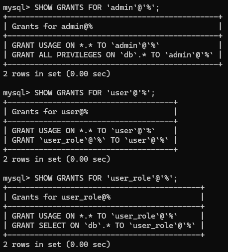
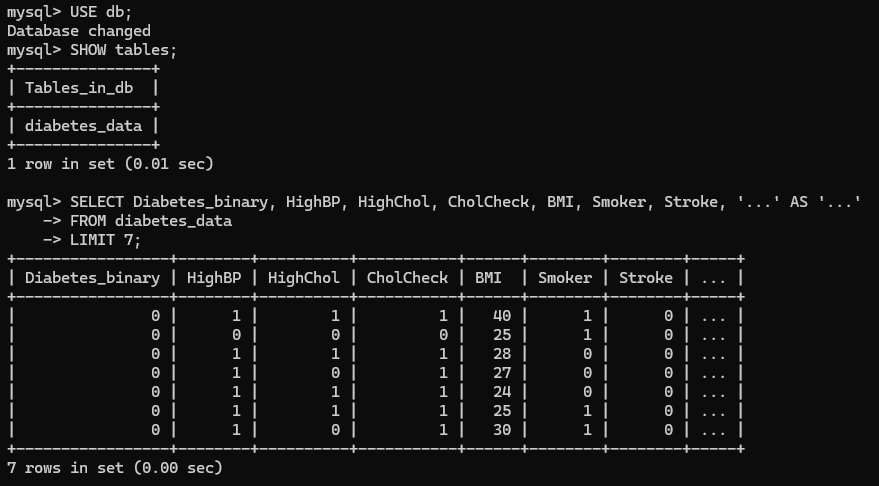

# ML Project

To run the project, first create a virtual environment

```
python3 -m venv env
source env/bin/activate
```
And install the dependencies
```
cd ml-project/
pip install -r requirements.txt
```

# Phase 1 : Data Engineering

## Step 1: Build and Run the Docker Image

Navigate to the `data-engineering` module and build and execute the Docker image:

```
cd modules/data-engineering/
docker-compose -f docker/docker-compose.yml up --build -d 
```

This command facilitates the creation of the DockerImage and execution of a MySQL container.

Details:
- Container name: `database`
- Database name: `db`
- Ports: `3306:3306`

---

The dataset will be automatically copied to the container.
Both `setup.sql` (located in `users/`) and `load.sql` (located in `load/`) are shared with the container and will be executed automatically, as they are inside the `docker-entrypoint-initdb.d` folder.

---

**`setup.sql`**

* Users:
    * user: `admin`, password: `admin`
    * user: `user`, password: `password`
* Permissions:
    * `admin` user has full control of the database.
    * `user` has the `user_role` role, with READ-ONLY permissions on the database.

To check permissions, log into MySQL as `root`:

```
docker exec -it database mysql -u root -p
```

When prompted for a password, enter: `root`

Then, execute the following commands:

```
SHOW GRANTS FOR 'admin'@'%';
SHOW GRANTS FOR 'user'@'%';
SHOW GRANTS FOR 'user_role'@'%'; 
```



&nbsp;


**`load.sql`**

- Creates the `db` database (if it does not already exist) and a table with the datasets' columns.
- Loads data from the `diabetes_012_health_indicators_BRFSS2015.csv` file into the corresponding table.



---

### Step 2: Access the Docker Container and Execute Queries

Enter the container as a user (in this case, _admin_):

```
docker exec -it database mysql -u admin -p
```

You'll be asked to provide the password. Enter the corresponding password for the user.

To see the available schemas:

```
SHOW schemas;
```

Select the `db` schema, check its tables, and view the loaded dataset:

```
USE db;
SHOW tables;
SELECT * FROM diabetes_data LIMIT 10;
```

*Note:* I used Docker Desktop to assist with the Docker framework and overall tasks. It provides a user-friendly interface for managing Docker containers and images, making it easier to monitor, start, stop, and troubleshoot containers.

